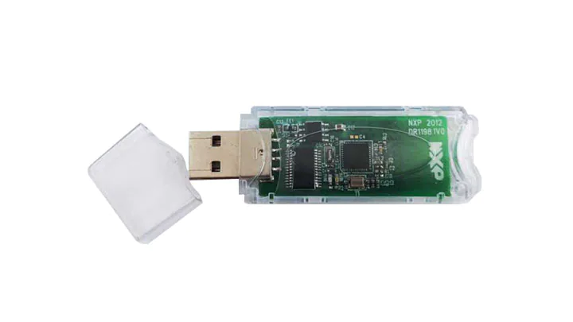
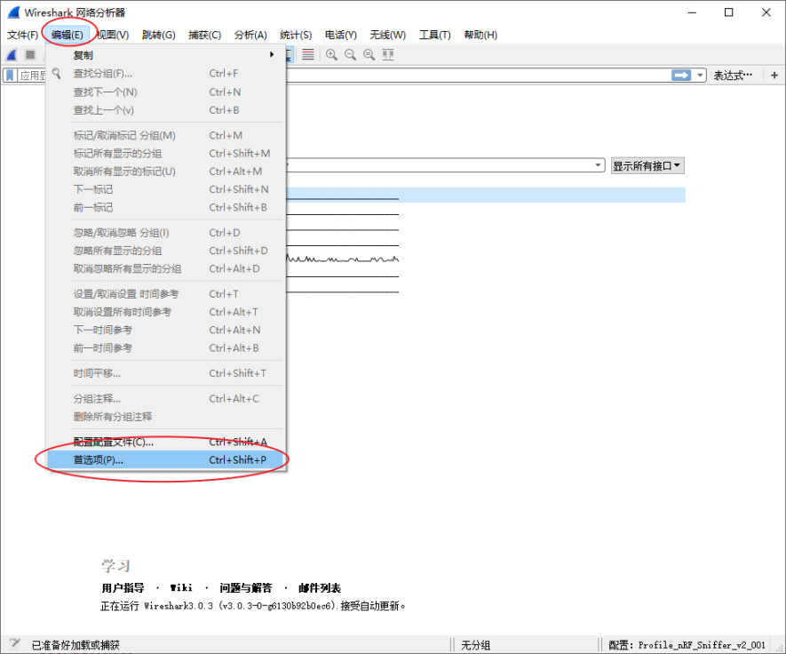
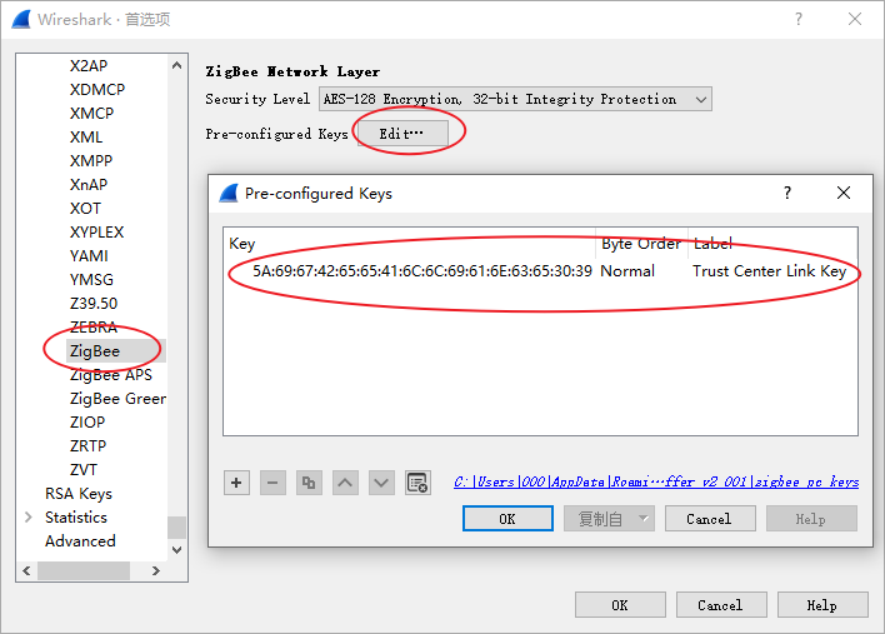
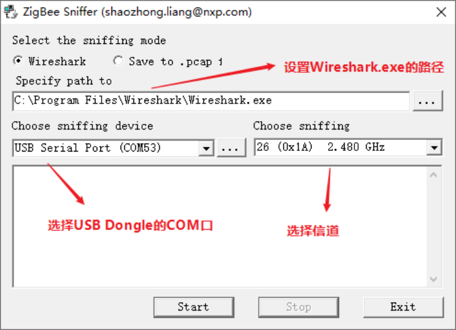
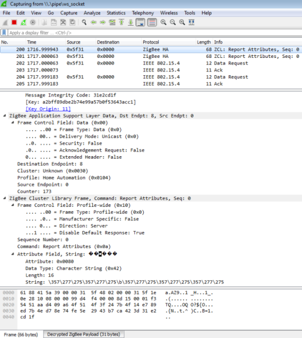
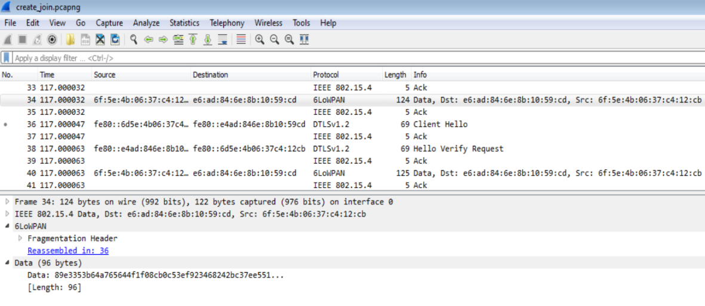
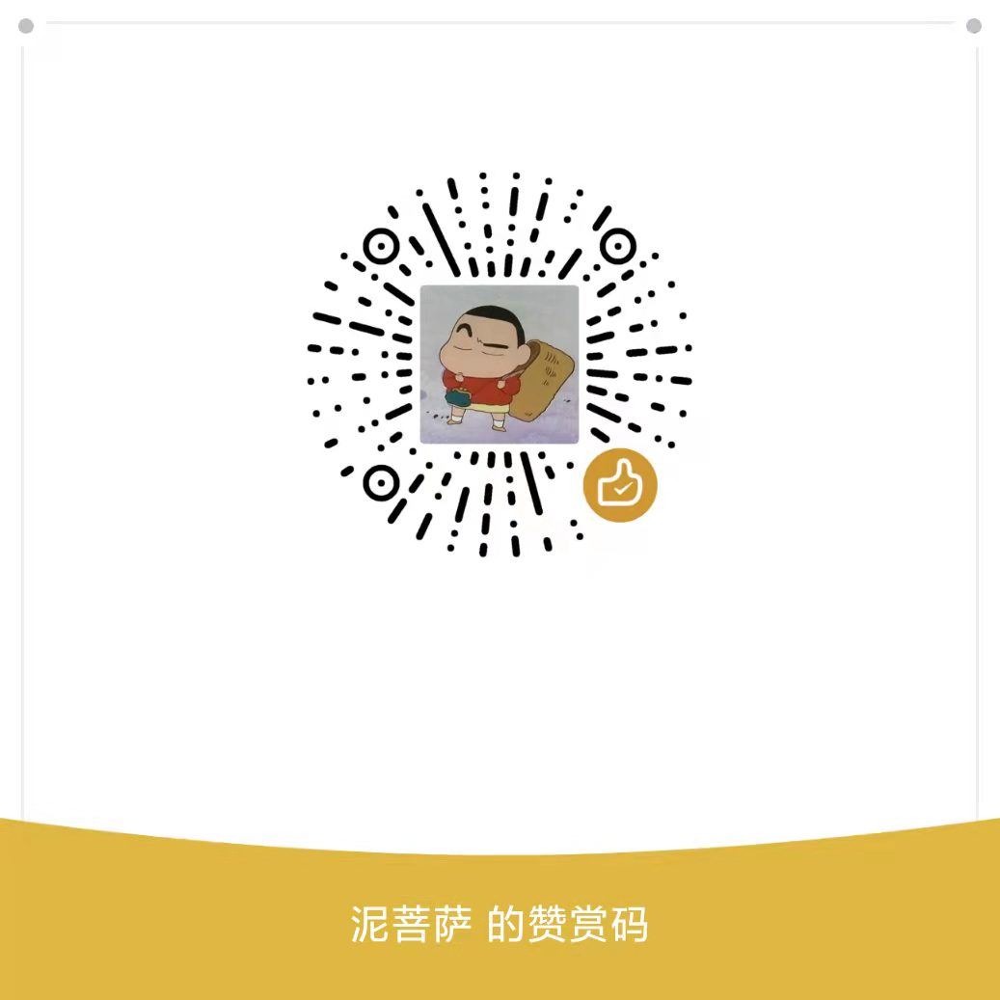

# om15020



## 版权说明

如果有侵犯到您的软件著作权，请联系本人进行删除！！！

## 下载固件

进入 [tools/ProductionFlashProgrammer](./tools/ProductionFlashProgrammer/) 目录, 在该目录打开 `Powershell`

```Powershell
PS .\JN51xxProgrammer.exe
Available connections:
COM56
PS .\JN51xxProgrammer.exe -s COM56 -f ..\..\firmware\JennicSniffer_JN5169_1000000.bin
```

## 固件说明

- [JennicSniffer_JN5169_1000000.bin](./firmware/JennicSniffer_JN5169_1000000.bin) : 抓包固件，用于捕获空气无线数据包

- [ZigbeeNodeControlBridge_JN5169_GP_Proxy_COORDINATOR_1000000.bin](./firmware/ZigbeeNodeControlBridge_JN5169_GP_Proxy_COORDINATOR_1000000.bin) : 协调器固件，配合zgwui上位机，可以作为网关，控制子设备等

## 抓包

可以配合 `Ubiqua` 和 `Wireshark` 使用。

> `Ubiqua` 为收费软件，呼吁大家支持正版。

### Wireshark

#### 设置Trust Center Link Key

在 Wireshark 中配置 ZigBee 默认的 Link Key，否则无法解析加密网络内容。

通过 `Edit` --> `Preferences` --> `Protocols` --> `ZigBee` 菜单配置16 字节的 `Trust Center Link Key={5A:69:67:42:65:65:41:6C:6C:69:61:6E:63:65:30:39}`





#### 运行 ZBSniffer.exe 抓包工具

在启动抓包前，先设置 Wireshark.exe 的目录， USB Dongle 的串口端口号和 ZigBee 的运
行信道。

点击 ZBSniffer.exe 的 `Start` 按钮后启动 Wireshark。 二者通过命名管道的方式交换抓包数据。 Wireshark 将会接收命名管道的数据，并解析 IEEE802.15.4 数据包。



下面是通过 Wireshark 解析 ZigBee 数据包的截图，可以将 ZigBee 的各个字段进行详细解析。



#### 抓取分析 IEEE802.15.4/Thread 协议

由于 Thread 与 ZigBee 都是基于 IEEE802.15.4 MAC，所以这个工具也可以通过 Wireshark 解析 Thread 协议。



## ZGWUI

[ZGWUI](./tools/ZGWUI/ZGWUI.lnk) 的详细使用说明，请参考 [JN-AN-1216-ZigBee-3-0-IoT-ControlBridge-UserGuide.pdf](./doc/JN-AN-1216-ZigBee-3-0-IoT-ControlBridge-UserGuide.pdf)

## 其他

更多资料，可以在[这里](https://www.nxp.com/pages/jn516x-7x-zigbee-3-0:ZIGBEE-3-0)下载

## 捐赠

如果上面的文档对您有很大帮助，您可以通过以下方式支持我们：


